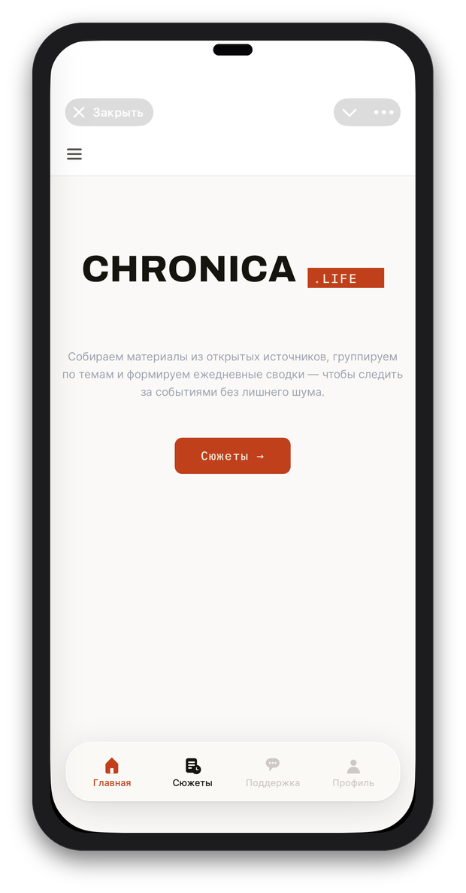
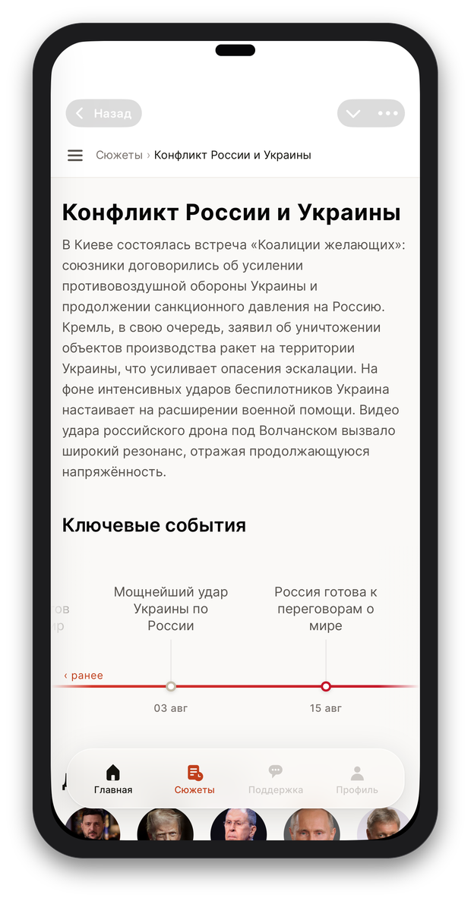
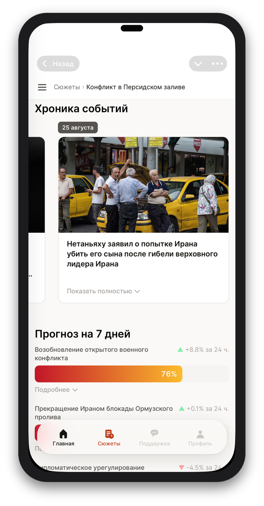
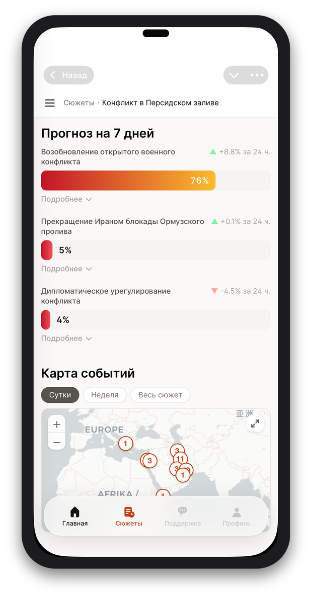
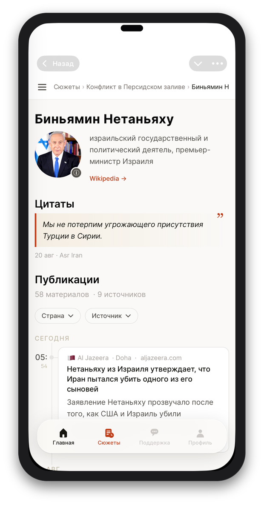
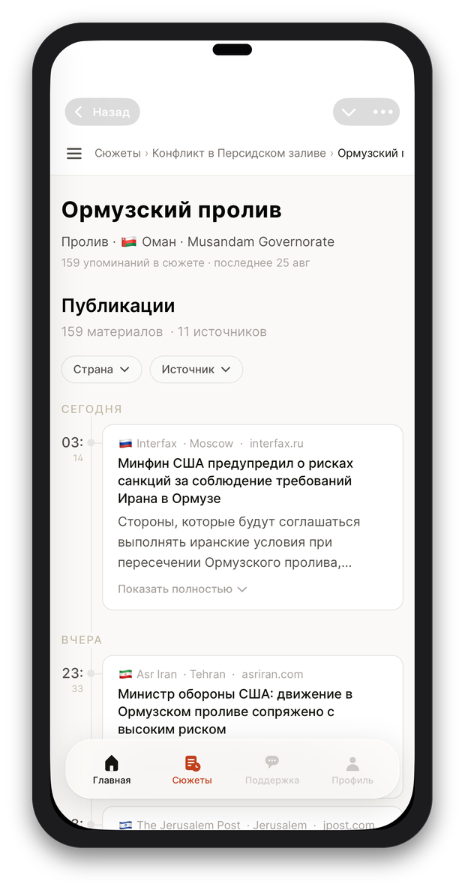

<div align="center">

# Chronica

### Хаос новостного потока, собранный в сюжеты

Тысячи заметок из RSS-лент через собственный DWH-конвейер и LLM: система сама находит связанные 
публикации, складывает их в сюжеты, восстанавливает хронологию, узнаёт действующих лиц и места 
событий — и досчитывает вероятность того, куда сюжет повернёт дальше.

</div>

<br>



<br>
<br>

## Без лишнего шума
Открываешь — и сразу главное. Материалы из открытых источников уже сгруппированы по темам:
никаких лент, никакого скролла в поисках сути.

<br clear="left"/>
<br>



<br>
<br>

## Сюжеты, а не заметки
Сотни публикаций из разных источников сходятся в одну карточку — со сводкой и хронологией
ключевых событий на общей шкале времени.

<br clear="left"/>
<br>



<br>
<br>

## Ни одна публикация не теряется
Карточка сюжета разворачивается в ленту первоисточников — вплоть до конкретного заголовка,
издания и минуты выхода.

<br clear="left"/>
<br>



<br>
<br>

## Куда идёт сюжет
Вероятностный прогноз на 7 дней с историей изменений день к дню и карта событий — сюжет
как живая система, а не застывший текст.

<br clear="left"/>
<br>



<br>
<br>

## Кто есть кто
Имена распознаются и разрешаются в устойчивые сущности: все упоминания одного человека —
цитаты, публикации, хроника — собираются в единый профиль.

<br clear="left"/>
<br>



<br>
<br>

## Где это происходит
Места событий геокодируются и сводятся в общий профиль — от страны и города до точки на карте.

<br clear="both"/>
<br>

## Что делает Chronica

- **Кластеризация в сюжеты.** Новости из десятков RSS-источников группируются по смыслу, а
  не по ключевым словам — эмбеддинги + LLM отличают развитие одной истории от случайного
  совпадения тем.
- **Хронология и ключевые события.** Для каждого сюжета восстанавливается лента событий во
  времени — от первой публикации до последней, с выделением поворотных моментов.
- **Действующие лица и места.** Имена и локации извлекаются из текста и разрешаются в
  устойчивые сущности (Wikidata для персон, GeoNames для мест), так что все упоминания одного
  человека или города собираются в единый профиль.
- **Вероятностные прогнозы.** По каждому активному сюжету LLM регулярно пересчитывает
  вероятность нескольких сценариев развития — с историей изменений день к дню.
- **Ежедневные сводки без шума.** Вместо потока из сотен заголовков — компактная выжимка по
  каждой теме, которую отслеживает читатель.
- **Рынок в том же контексте.** Поток сделок с MOEX собирается параллельно, чтобы рыночную
  реакцию можно было сопоставить с новостным фоном.

<br>

---

## Архитектура

```
RSS-источники → rss-fetcher ──┐
                               ├──→ Redpanda ──→ Redpanda Connect → PostgreSQL → Evidence.dev
MOEX → moex-fetcher ──────────┘                                          ↑
                                  ↑                          DeepSeek (cloud LLM) / Ollama (embeddings)
                               Redis (кэш)         ClickHouse ←── moex-fetcher
```

### Сервисы (`/services`)

| Сервис | Описание |
|--------|----------|
| `rss-fetcher` | Периодический опрос RSS-лент, парсинг и публикация новостей в Redpanda |
| `moex-fetcher` | Стриминг биржевых сделок с MOEX ISS API, запись в ClickHouse (`ods.moex_trades`) |
| `tg-sender` | Отправка персонализированных уведомлений о новостях подписчикам в Telegram (консьюмер топика `tg_notifications`) |
| `api` | FastAPI-бэкенд для фронтенда Signalfire |

### Хранилище данных (`/dwh`)

**PostgreSQL** — основное хранилище новостей и сводок:

| Слой | Описание |
|------|----------|
| `ods` | Сырые данные из источников |
| `dds` | Хабы, сателлиты, справочники, сводки по сюжетам |
| `bds` | Материализованные представления с бизнес-логикой поверх `dds` |
| `dm` | Витрины данных для дашборда (views) |

Инфраструктура DWH:

| Компонент | Описание |
|-----------|----------|
| **PostgreSQL** | Основное хранилище новостей (схемы `ods`, `dds`, `dm`) |
| **ClickHouse** | Аналитическое хранилище биржевых данных · HTTP `http://localhost:38123` |
| **Redpanda** | Kafka-совместимый брокер сообщений |
| **Redpanda Connect** | Потоковый ETL: читает топики, пишет в PostgreSQL (конфигурации в `dwh/rpc/`) |
| **Redpanda Console** | Web UI для управления топиками · `http://localhost:38088` |
| **Redis** | LRU-кэш без персистентности (512 МБ, `allkeys-lru`) |
| **RedisInsight** | Web UI для Redis · `http://localhost:35540` |
| **Ollama** | Локальный запуск LLM для генерации эмбеддингов новостей |
| **DeepSeek** | Облачный LLM API (`deepseek-v4-flash`) для генерации сводок, брифов, реакций и извлечения мест событий из новостей — вызывается из процессоров Redpanda Connect (`dwh/rpc/dds/`, `dwh/rpc/dm/`) |
| **GeoNames** | Внешний API геокодирования (`api.geonames.org`) для стандартизации мест событий новостей — вызывается из пайплайна `dwh/rpc/dds/LOAD_DDS_T_NEWS_LOCATIONS.yaml` с rate limit под бесплатный тариф (требует `GEONAMES__USERNAME` в `.env`) |
| **dbt** | Трансформации данных поверх DWH |
| **MinIO** | S3-совместимое объектное хранилище |

### Дашборд (`/evidence`)

Evidence.dev — фронтенд для визуализации данных. Показывает ежедневные хроники событий по сюжетам.

- Dev: `http://localhost:33001`
- Prod: `http://localhost:33000`

### Общие компоненты (`/common`)

Pydantic-модели, конфигурации и утилиты, разделяемые между сервисами.

## Технологический стек

- **Python** 3.14+ · [uv](https://github.com/astral-sh/uv)
- **БД**: PostgreSQL, ClickHouse, Redis (LRU-кэш)
- **Брокер**: Redpanda + Redpanda Connect
- **LLM**: DeepSeek (cloud API, сводки/брифы/реакции/места событий) · Ollama (локальные эмбеддинги)
- **Внешние API**: GeoNames (геокодирование мест событий)
- **Дашборд**: Evidence.dev (SvelteKit)
- **Инфраструктура**: Docker Compose

## Запуск

### Требования

- Docker и Docker Compose
- [uv](https://github.com/astral-sh/uv) — для локальной разработки сервисов

### Инфраструктура

```bash
docker compose up -d
```

### Evidence (дашборд)

```bash
# Первый запуск (инициализация)
cd evidence/compose && docker compose run --rm chr-evidence-dev init

# Dev-режим (hot reload)
cd evidence/compose && docker compose up chr-evidence-dev

# Prod-режим
cd evidence/compose && docker compose up chr-evidence-prod
```

## Конфигурация

- RSS-источники: `services/rss-fetcher/config/rss_feeds.yaml`
- MOEX (тикеры, расписание): `services/moex-fetcher/config/config.yml`
- Переменные окружения: `.env` (единственный активный конфиг; `.env.server` — инертная копия
  локальных dev-значений для ручной подмены)
- Миграции PostgreSQL: `dwh/migrations/pg/`
- Миграции ClickHouse: `dwh/migrations/ch/`